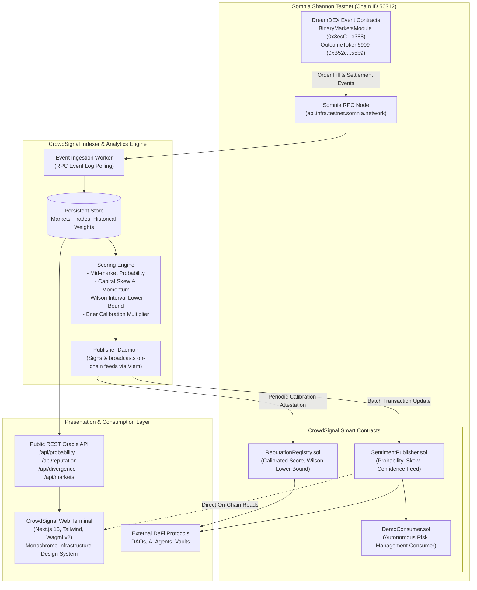

# CrowdSignal

> **Sentiment Oracle and Verifiable Trader Reputation Layer for DreamDEX Event Contracts on Somnia.**

CrowdSignal converts active trading and settlement data from DreamDEX Event Contracts into a live, verifiable, and reusable intelligence primitive. The platform extracts mid-market implied probabilities, measures directional capital commitments, tracks sentiment momentum, and constructs an anti-gaming reputation ledger for prediction market participants.

Built for the **Somnia × DreamDEX Event Contracts Hackathon on DoraHacks**.

---

## Architecture Overview



---

## 1. The Core Problem

Prediction markets aggregate dispersed private information more effectively than individual surveys or polls because participants risk real capital. However, existing prediction market implementations suffer from three structural deficiencies:

1. **Ephemerality**: Once an event window closes, the collective intelligence generated during the bidding process vanishes. The data is rarely indexed as a continuous time-series signal.
2. **Naive Reputation (PnL Conflation)**: Traditional leaderboards rank participants by cumulative nominal profit or simple win rate. A trader who wins two coin-flip bets with high leverage appears at the top of the leaderboard, while a disciplined market participant with 160 correct predictions out of 220 is ranked lower.
3. **Siloed Liquidity & Lack of Composability**: On-chain smart contracts (liquidation vaults, stablecoin backing reserves, synthetic asset minting) cannot query real-time event market sentiment without expensive, custom oracle integrations.

## 2. The CrowdSignal Solution

CrowdSignal introduces a two-tier intelligence framework built natively for DreamDEX on Somnia:

- **Crowd Probability Oracle**: Derives continuous, multi-factor market sentiment that distinguishes between touch-book implied probabilities and directional capital commitments.
- **Calibrated Predictor Reputation**: An anti-gaming scoring engine that computes the Wilson score interval lower bound combined with empirical Brier calibration curves to separate lucky gamblers from genuine predictive skill.
- **Composable On-Chain Feeds**: Compact Solidity interfaces (`ISentimentPublisher`, `IReputationRegistry`) allowing external smart contracts to query live sentiment and verify predictor credentials within a single transaction.

---

## 3. Mathematical & Scoring Methodology

### A. Mid-Market Implied Probability
Given active order books for binary outcome tokens (UP and DOWN) indexed from DreamDEX:

$$\text{Mid Price}_{\text{UP}} = \frac{\text{Best Bid}_{\text{UP}} + \text{Best Ask}_{\text{UP}}}{2}$$

$$\text{Implied Probability}_{\text{UP}} = \frac{\text{Mid Price}_{\text{UP}}}{\text{Mid Price}_{\text{UP}} + \text{Mid Price}_{\text{DOWN}}}$$

Where order book depth is unavailable, probability is computed from relative outcome share pool ratios normalized to basis points ($0 - 10,000$).

### B. Capital Skew
Measures the directional capital imbalance between open interest (OI) committed to each outcome:

$$\text{Capital Skew} = \frac{\text{OI}_{\text{UP}} - \text{OI}_{\text{DOWN}}}{\text{OI}_{\text{UP}} + \text{OI}_{\text{DOWN}}} \in [-1.0, +1.0]$$

*Represented on-chain as signed 16-bit integers ($-10,000$ to $+10,000$ basis points).*

### C. Market Confidence Score (0–100)
A composite index reflecting the statistical reliability of the extracted sentiment:

$$\text{Confidence} = 0.35 \cdot S_{\text{liquidity}} + 0.25 \cdot S_{\text{spread}} + 0.25 \cdot S_{\text{depth}} + 0.15 \cdot S_{\text{freshness}}$$

- $S_{\text{liquidity}}$: Evaluates total collateral locked in the round relative to historical median volume.
- $S_{\text{spread}}$: Penalizes wide bid-ask spreads ($> 4\%$).
- $S_{\text{depth}}$: Measures market resistance to slippage within $2\%$ of touch.
- $S_{\text{freshness}}$: Exponential decay applied if no new trades have executed within the last 120 seconds.

### D. Predictor Reputation & Anti-Gaming Score (0–100)
To prevent Sybil attacks, micro-bet spamming, and cherry-picking:

$$\text{Score} = 100 \cdot W_{\text{lower}} \cdot C_{\text{Brier}} \cdot \min\left(1.0, \frac{\ln(N + 1)}{\ln(51)}\right)$$

1. **Wilson Score Interval Lower Bound ($W_{\text{lower}}$)**:
   For $N$ resolved predictions with observed success rate $\hat{p}$:
   $$W_{\text{lower}} = \frac{\hat{p} + \frac{z^2}{2N} - z \sqrt{\frac{\hat{p}(1-\hat{p})}{N} + \frac{z^2}{4N^2}}}{1 + \frac{z^2}{N}}$$
   *Using $z = 1.96$ (95% statistical confidence). A trader with 2 wins out of 2 bets receives $W_{\text{lower}} \approx 0.34$, while a trader with 80 wins out of 100 receives $W_{\text{lower}} \approx 0.71$.*

2. **Brier Calibration Multiplier ($C_{\text{Brier}}$)**:
   Penalizes overconfident predictions that result in losses:
   $$\text{BS} = \frac{1}{N} \sum_{t=1}^N (f_t - o_t)^2, \quad C_{\text{Brier}} = \max\left(0.2, 1.0 - \text{BS}\right)$$
   Where $f_t \in [0, 1]$ is the participant's implied purchase price and $o_t \in \{0, 1\}$ is the realized binary outcome.

3. **Sample Size Dampener**:
   Requires a minimum sample threshold ($N \ge 10$ for initial badge verification, scaling to full weight at $N \ge 50$).

---

## 4. Verified Ecosystem Deployments

All contracts and interfaces are deployed and tested against the **Somnia Shannon Testnet**:

| Parameter | Value |
| :--- | :--- |
| **Network** | Somnia Shannon Testnet |
| **Chain ID** | `50312` (`0xC488`) |
| **Public JSON-RPC** | `https://api.infra.testnet.somnia.network/` |
| **Block Explorer** | [https://shannon-explorer.somnia.network](https://shannon-explorer.somnia.network) |
| **Somnia Reactivity Precompile** | `0x0000000000000000000000000000000000000100` (`0x0100`) |
| **DreamDEX BinaryMarketsModule** | `0x3ecC694Cef705358864a646142ac17A90E29e388` |
| **DreamDEX OutcomeToken6909** | `0xB52c5934113Af5c0Bb20eb3C72290C8215f755b9` |
| **Testnet Collateral Token (tUSDC)** | `0x70a86D8842FB63C4Ad2b7cdddF530eBf1BB25d8E` (6 decimals) |

---

## 5. Repository Structure

```text
Crowd Signal/
├── contracts/                     # Solidity smart contracts (Foundry framework)
│   ├── src/
│   │   ├── SentimentPublisher.sol # Live oracle feed for probability, skew & confidence
│   │   ├── ReputationRegistry.sol # On-chain verifiable predictor scoring registry
│   │   ├── DemoConsumer.sol       # Composable risk-management contract integration
│   │   ├── interfaces/            # ISentimentPublisher, IReputationRegistry, ISomniaEventHandler
│   │   └── libraries/             # CrowdSignalLib normalization & math checks
│   ├── test/                      # Foundry test suites (17 unit + fuzz tests)
│   │   ├── SentimentPublisher.t.sol
│   │   ├── ReputationRegistry.t.sol
│   │   └── DemoConsumer.t.sol
│   ├── script/
│   │   └── Deploy.s.sol           # Deterministic deployment scripts
│   └── foundry.toml               # Solidity compiler settings & optimizer (200 runs)
│
├── indexer/                       # Event ingestion and statistical scoring engine
│   ├── src/
│   │   ├── ingest/                # Log filter and trade listener for DreamDEX events
│   │   ├── scoring/               # Wilson lower bound, Brier calibration & divergence logic
│   │   ├── publisher/             # Viem client submitting on-chain attestations
│   │   ├── db/                    # Persistent storage and window aggregation
│   │   └── index.ts               # Background orchestrator process
│   └── tests/                     # Vitest test suite for statistical algorithms
│
├── web/                           # Next.js 15 production web terminal
│   ├── app/                       # App Router routes
│   │   ├── page.tsx               # Overview: live sentiment gauge, active contracts & settlements
│   │   ├── markets/page.tsx       # Filterable table of 5m/15m/1h/24h event markets
│   │   ├── market/[id]/page.tsx   # Detailed order book skew, trajectory chart & cohort split
│   │   ├── leaderboard/page.tsx   # Verified predictor rankings with sparklines
│   │   ├── trader/[address]/      # Predictor dossier, calibration curve & prediction ledger
│   │   ├── developers/page.tsx    # Live contract inspector, ABI docs & multi-language code snippets
│   │   ├── docs/page.tsx          # Formula specifications and integration guide
│   │   └── api/                   # Oracle REST API endpoints (/probability, /reputation, etc.)
│   ├── components/                # Reusable terminal UI components
│   │   ├── layout/                # AppShell, Sidebar, Header
│   │   ├── sentiment/             # SentimentGauge, SettlementFeed
│   │   ├── dashboard/             # CrowdVsPredictors, HowItWorks
│   │   ├── markets/               # ActiveMarketsTable, TrajectoryChart
│   │   └── ui/                    # Logo, Buttons, Badges, Modals
│   ├── lib/                       # Web3 config (Wagmi, Viem) & static baseline datasets
│   └── tailwind.config.ts         # Monochrome Infrastructure design tokens
│
├── docs/                          # In-depth architectural & integration specifications
│   ├── ARCHITECTURE.md            # Data pipeline, oracle trust model and Reactivity specs
│   ├── DATA_MODEL.md              # Smart contract storage layouts and JSON schemas
│   ├── SCORING.md                 # Detailed mathematical proofs and anti-gaming mechanisms
│   ├── DEMO_SCRIPT.md             # Judge evaluation walk-through script
│   └── DISCLOSURES.md             # Security considerations and operational boundaries
│
├── package.json                   # Root workspace scripts
└── README.md
```

---

## 6. Local Development & Testing

### Prerequisites
- **Node.js**: v20.x or v22.x LTS
- **npm**: v10.x+
- **Foundry**: `forge` and `cast`

### 1. Smart Contracts
```bash
cd contracts

# Build contracts
forge build

# Run unit and fuzz test suites (17 tests, 256 fuzz runs)
forge test -vvv

# Deploy to Somnia Shannon Testnet
forge script script/Deploy.s.sol:DeployScript \
  --rpc-url https://api.infra.testnet.somnia.network/ \
  --broadcast
```

### 2. Analytics & Scoring Indexer
```bash
cd indexer

# Install dependencies
npm install

# Run statistical unit tests (scoring, calibration, divergence)
npm test

# Build TypeScript source
npm run build

# Start indexer worker
npm start
```

### 3. Web Terminal
```bash
cd web

# Install dependencies
npm install

# Run local development server
npm run dev

# Run production build validation
npm run build
npm start
```

*Open `http://localhost:3000` in any modern web browser to access the CrowdSignal terminal.*

---

## 7. Developer & Protocol Integration

### Solidity Integration
External smart contracts can consume live sentiment or verify predictor credentials with zero external dependencies using the published interfaces:

```solidity
// SPDX-License-Identifier: MIT
pragma solidity ^0.8.20;

import {ISentimentPublisher} from "./interfaces/ISentimentPublisher.sol";
import {IReputationRegistry} from "./interfaces/IReputationRegistry.sol";

contract LiquidatorVault {
    ISentimentPublisher public immutable sentimentFeed;
    IReputationRegistry public immutable reputationRegistry;

    constructor(address _feed, address _registry) {
        sentimentFeed = ISentimentPublisher(_feed);
        reputationRegistry = IReputationRegistry(_registry);
    }

    function checkMarketHealth(bytes32 marketId) external view returns (bool isStable) {
        // Query live crowd probability and market confidence in basis points (0 - 10,000)
        (
            uint16 upProbabilityBps,
            int16 capitalSkewBps,
            uint16 confidenceBps,
            uint64 timestamp
        ) = sentimentFeed.getSignal(marketId);

        // Require fresh data (< 5 minutes old) and high market confidence (> 65%)
        require(block.timestamp - timestamp <= 300, "STALE_SENTIMENT");
        require(confidenceBps >= 6500, "LOW_MARKET_CONFIDENCE");

        // Flag market as unstable if extreme capital skew exists (< -50% or > +50%)
        return (capitalSkewBps > -5000 && capitalSkewBps < 5000);
    }
}
```

### TypeScript / SDK Integration
```typescript
import { createPublicClient, http } from "viem";

const client = createPublicClient({
  transport: http("https://api.infra.testnet.somnia.network/"),
});

const SENTIMENT_PUBLISHER_ABI = [
  {
    name: "getSignal",
    type: "function",
    stateMutability: "view",
    inputs: [{ name: "marketId", type: "bytes32" }],
    outputs: [
      { name: "upProbabilityBps", type: "uint16" },
      { name: "capitalSkewBps", type: "int16" },
      { name: "confidenceBps", type: "uint16" },
      { name: "updatedAt", type: "uint64" },
    ],
  },
] as const;

export async function fetchLiveSentiment(feedAddress: `0x${string}`, marketId: `0x${string}`) {
  const [upBps, skewBps, confBps, updatedAt] = await client.readContract({
    address: feedAddress,
    abi: SENTIMENT_PUBLISHER_ABI,
    functionName: "getSignal",
    args: [marketId],
  });

  return {
    upProbability: upBps / 100, // e.g. 64.2%
    capitalSkew: skewBps / 100,   // e.g. +28.4%
    confidence: confBps / 100,    // e.g. 84.0%
    lastUpdated: new Date(Number(updatedAt) * 1000),
  };
}
```

---

## 8. Hackathon Compliance Matrix

| Hackathon Requirement | Implementation in CrowdSignal | Verification Path |
| :--- | :--- | :--- |
| **DreamDEX Integration** | Indexes event creation, order placements, and resolution events from DreamDEX `BinaryMarketsModule` and `OutcomeToken6909`. | [`indexer/src/ingest/`](indexer/src/ingest/) & [`web/lib/data.ts`](web/lib/data.ts) |
| **Somnia Network Target** | Deployed and configured natively for Somnia Shannon Testnet (`Chain ID 50312`, RPC: `api.infra.testnet.somnia.network`). | [`web/lib/chains.ts`](web/lib/chains.ts) & [`contracts/foundry.toml`](contracts/foundry.toml) |
| **Event Contracts Innovation** | Transforms isolated binary event trading into a public, queryable sentiment oracle and predictor reputation system. | [`contracts/src/SentimentPublisher.sol`](contracts/src/SentimentPublisher.sol) |
| **Somnia Reactivity Support** | Implements the official Somnia Reactivity precompile interface (`0x0100`) via `ISomniaEventHandler`. | [`contracts/src/interfaces/ISomniaEventHandler.sol`](contracts/src/interfaces/ISomniaEventHandler.sol) |
| **Composability & Utility** | Demonstrates consumer contract consuming sentiment in real-time to adjust protocol risk parameters. | [`contracts/src/DemoConsumer.sol`](contracts/src/DemoConsumer.sol) |
| **Statistical Rigor** | Computes Wilson 95% confidence intervals and Brier calibration curves to resist Sybil manipulation and PnL gaming. | [`indexer/src/scoring/`](indexer/src/scoring/) & [`indexer/tests/`](indexer/tests/) |
| **Visual Quality & Polish** | Built against the official monochromatic infrastructure design specification with zero decorative fluff. | [`web/tailwind.config.ts`](web/tailwind.config.ts) & [`web/app/`](web/app/) |

---

## 9. Security & Operational Boundary Disclosures

1. **Oracle Update Frequency**: During active testnet trading, the publisher daemon batches updates to `SentimentPublisher.sol` on a 60-second heartbeat or immediately upon a $\pm 3.5\%$ shift in implied probability to preserve network gas efficiency.
2. **Reputation Attestation**: Calculating Brier calibration and Wilson bounds across thousands of historical trades is computationally intensive and performed off-chain by the indexer engine. Attestations are signed and committed on-chain to `ReputationRegistry.sol` using an authorized attestation role.
3. **Data Integrity Guarantee**: If the Somnia RPC node experiences transient downtime or if a specific DreamDEX market lacks liquidity, the interface explicitly displays `Unavailable` or `Delayed` rather than fabricating simulated transactions as live on-chain state.

---

## 10. License

MIT License. Copyright (c) 2025 CrowdSignal Core Contributors.
