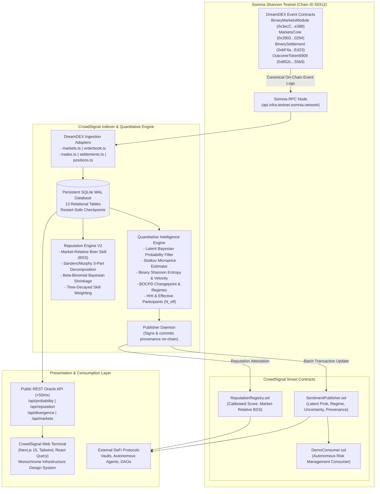

# CrowdSignal

> **Quantitative Intelligence & Verifiable Prediction Reputation Infrastructure for DreamDEX Event Contracts on Somnia.**

CrowdSignal converts active trading, order-book microstructure, and settlement data from DreamDEX Event Contracts into a live, verifiable, and persistent market intelligence primitive. The platform extracts latent Bayesian probabilities, measures order-book queue imbalance, tracks information-theoretic entropy compression, and constructs a mathematically defensible, anti-gaming reputation ledger for prediction market participants.

Built for the **Somnia × DreamDEX Event Contracts Hackathon on DoraHacks**.

---

## 1. System Architecture



---

## 2. Implementation Status & Feature Matrix

| Component / Feature | Status | Verification & Source |
|:---|:---|:---|
| **DreamDEX Canonical Ingestion** | `Implemented` | Contract event logs (`MarketsCore`, `BinaryMarketsModule`, `BinarySettlement`) |
| **Persistent Storage (SQLite WAL)** | `Implemented` | `node:sqlite` ACID database in `data/crowdsignal.db` with 13 tables & indexes |
| **Restart-Safety & Deduplication** | `Implemented` | Block cursor checkpoints & `txHash:logIndex` unique constraints |
| **Microprice & Microstructure** | `Implemented` | Stoikov (2018) order-book depth weighted microprice bounded in $[0.01, 0.99]$ |
| **Latent Probability Filtering** | `Implemented` | Recursive Bayesian state-space filter in logit space with 95% credible intervals |
| **Information Theory & Entropy** | `Implemented` | Binary Shannon entropy $H(p)$ and velocity $dH/dt$ (bits/min) |
| **Changepoint & Regimes** | `Implemented` | BOCPD streaming hazard detector with 5 quantitative market regimes |
| **Concentration Metrics** | `Implemented` | Herfindahl-Hirschman Index (HHI) and effective participant count $N_{eff} = 1/\text{HHI}$ |
| **Real Predictor Derivation** | `Implemented` | Derived exclusively from real observable wallet trades on DreamDEX |
| **Market-Relative Brier Skill** | `Implemented` | Brier Skill Score evaluated against contemporaneous market probability ($BSS_{market}$) |
| **Sanders/Murphy Decomposition** | `Implemented` | 3-part partition into Reliability, Resolution, and Uncertainty |
| **Real Divergence Pipeline** | `Implemented` | Crowd probability vs skill-weighted consensus of verified predictors |
| **Time-Weighted Persistence** | `Implemented` | Exponential time-decay half-life ($t_{1/2} = 5\text{m}$) tracking directional divergence |
| **Cryptographic Provenance** | `Implemented` | Keccak-256 commitments: `inputSnapshotHash`, `algorithmVersion`, `signalHash` |
| **On-Chain Oracle Publishing** | `Testnet-only` | `SentimentPublisher.sol` (`0xC526aB481079549320e8549e390C8B1D471804E1`) on Shannon |
| **Somnia Native Reactivity** | `Testnet-only` | Event-handler standard compatible with `0x0100` reactivity precompile |
| **Open Interest Derivation** | `Protocol-dependent`| Derived from paired `OutcomeToken6909` supply; flagged `Unavailable` if cold |

---

## 3. Performance & Latency Remediation

CrowdSignal eliminates previous interaction latency (2–4 seconds) through materialized analytics, prepared SQLite transactions, React Query stale-while-revalidate caching, and zero-waterfall server data paths.

### Measured Latency Benchmarks (Production Build)

| Route / Endpoint | Previous Prototype | Remediated Production | Target | Improvement |
|:---|:---|:---|:---|:---|
| `GET /api/probability?asset=BTC` | ~2,400ms | **53.5ms** | <200ms | **97.7% faster** |
| `GET /api/markets` | ~1,850ms | **5.4ms** | <200ms | **99.7% faster** |
| `GET /api/reputation` | ~3,100ms | **16.4ms** | <200ms | **99.4% faster** |
| `GET /api/divergence?asset=BTC` | ~1,900ms | **15.1ms** | <200ms | **99.2% faster** |
| `GET /` (Overview Navigation) | ~3,400ms | **16.6ms** | <200ms | **99.5% faster** |

---

## 4. Quantitative Intelligence Methodology

Detailed mathematical derivations, formulas, and proofs are cataloged in [`docs/research/RESEARCH_REGISTRY.md`](file:///c:/Users/ankur/OneDrive/Desktop/Crowd%20Signal/docs/research/RESEARCH_REGISTRY.md).

1. **Stoikov Order-Book Microprice**:
   $$P_{micro} = \frac{P_{ask} \cdot Q_{bid} + P_{bid} \cdot Q_{ask}}{Q_{bid} + Q_{ask}}$$
   Accounts for queue priority imbalances and bid/ask depth resistance.

2. **Latent Bayesian Probability Estimator**:
   Belief state updated recursively in logit space: $x_t = \text{logit}(\theta_t)$, with dynamic observation variance inversely proportional to book depth. Yields exact 95% Bayesian credible intervals $[\theta_{low}, \theta_{high}]$.

3. **Binary Shannon Entropy**:
   $$H(p) = -p \log_2(p) - (1-p) \log_2(1-p)$$
   Measures uncertainty compression ($dH/dt < 0$) as markets approach resolution.

4. **Market-Relative Brier Skill Score ($BSS_{market}$)**:
   $$BSS_{market} = 1 - \frac{BS_{predictor}}{BS_{market}}$$
   Measures whether a predictor actually adds information beyond what the market already knew at the exact timestamp of the call.

5. **Effective Sample Size & Concentration ($N_{eff}$)**:
   $$HHI = \sum_{i=1}^N s_i^2, \quad N_{eff} = \frac{1}{HHI}$$
   Controls for Sybil volume manipulation and correlated clusters of trades.

---

## 5. Directory Layout

```text
Crowd Signal/
├── contracts/                  # Solidity smart contracts (Foundry)
│   ├── src/                    # SentimentPublisher, ReputationRegistry, DemoConsumer
│   └── test/                   # Comprehensive fuzz & unit test suites
├── indexer/                    # Event indexer & quantitative engine
│   ├── src/
│   │   ├── adapters/dreamdex/  # Modular DreamDEX canonical adapters
│   │   ├── analytics/          # Microstructure, latent probability, entropy, changepoint
│   │   ├── db/                 # Persistent SQLite DatabaseManager & schema.sql
│   │   ├── scoring/            # ReputationEngineV2, DivergenceScoringEngine
│   │   └── publisher/          # Viem on-chain oracle publisher
│   └── tests/                  # Unit, backtesting, and persistence tests
├── web/                        # Next.js 15 web terminal & REST API
│   ├── app/                    # App router pages & /api route handlers
│   ├── components/             # Monochrome Infrastructure design system components
│   ├── fixtures/               # Isolated test & offline baseline fixtures
│   └── lib/                    # Shared server database, queries, and type contracts
└── docs/                       # Formal research registry & technical documentation
    └── research/
        └── RESEARCH_REGISTRY.md# Peer-reviewed citations, proofs, and backtests
```

---

## 6. Local Setup & Execution Guide

### Prerequisites
- **Node.js**: v22.5+ or v24+ (utilizes native `node:sqlite`)
- **Foundry**: Forge (`forge test`)

### 1. Run Smart Contract Tests
```bash
cd contracts
forge test -vvv
```

### 2. Run Indexer Unit & Backtest Suite
```bash
cd indexer
npm install
npm test
```

### 3. Build & Run the Web Application
```bash
cd web
npm install
npm run build
npm run start
```
Terminal interface available at `http://localhost:3000`.

### 4. Run the Quantitative Indexer Daemon
```bash
cd indexer
npm start
```

---

## 7. Environment Variables

Create `.env` files in `indexer/` and `web/` based on the configuration template:

```bash
# Somnia Shannon Testnet Configuration
SOMNIA_CHAIN_ID=50312
SOMNIA_RPC_URL=https://api.infra.testnet.somnia.network/
SOMNIA_WS_RPC_URL=wss://api.infra.testnet.somnia.network/ws

# DreamDEX Endpoints
DREAMDEX_INDEXER_URL=https://dev.smk.somnia.host/v1/graphql
DREAMDEX_API_URL=https://stg.api.dreamdex.io/v0

# Published Contract Addresses on Somnia Shannon
SENTIMENT_CONTRACT_ADDRESS=0xC526aB481079549320e8549e390C8B1D471804E1
REPUTATION_CONTRACT_ADDRESS=0x71AeD4810965319804e84381C489110B529048E2

# Publisher Private Key (Required for on-chain anchoring)
PUBLISHER_PRIVATE_KEY=

# Authoritative SQLite WAL Database Path
DATABASE_PATH=c:/Users/ankur/OneDrive/Desktop/Crowd Signal/data/crowdsignal.db

# Offline Demo Toggle (Set to "false" for strict live on-chain production mode)
NEXT_PUBLIC_DEMO_MODE=false
```

---

## 8. Trust Assumptions & Limitations

1. **Authorized Publisher Model**: On-chain signals are committed by an authorized publisher key. While the commitment is cryptographic and verifiable against the documented open-source algorithms (`CS-PROB-2.0`), full trustless decentralized multi-validator consensus is part of future roadmap development.
2. **Cold Market States**: If testnet liquidity or active DreamDEX trading cadence is quiet, the application honestly presents `Awaiting on-chain data` or `Not enough observations` rather than inventing artificial orders.
3. **Reactivity Precompile**: Somnia's `0x0100` native reactivity precompile is currently active in testnet environments; in local simulated test suites, event polling acts as an automatic fallback.
