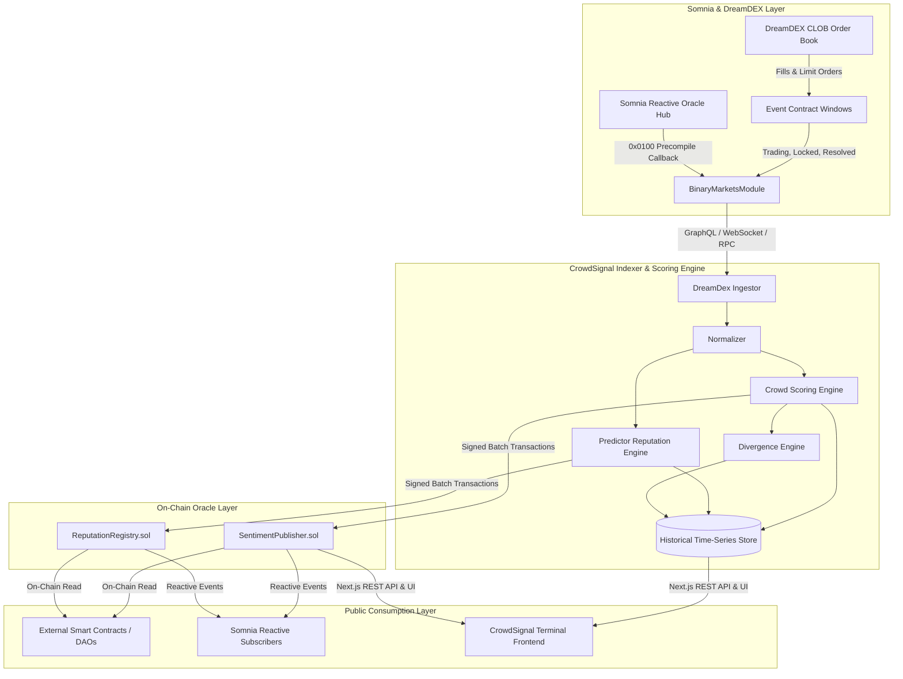

# CrowdSignal Architecture Specification

## 1. Executive Summary

CrowdSignal is a **Live Event Intelligence Oracle + Verifiable Prediction Reputation Layer** built for DreamDEX Event Contracts on the Somnia Shannon Layer-1 blockchain.

The product solves a fundamental structural issue in prediction markets:
> Event Contracts create a rich, capital-backed signal regarding short-term collective expectations (e.g. BTC Up 64.2%, Down 35.8%). In traditional setups, this information is confined to the trading UI and evaporates once a window settles. CrowdSignal transforms this high-frequency market activity into structured, verifiable, and persistent on-chain intelligence accessible to DAOs, DeFi protocols, autonomous AI agents, and other smart contracts.

---

## 2. End-to-End Pipeline

---

## 3. Core System Components

### 3.1 Smart Contracts (`contracts/`)
Deploys natively to Somnia Shannon Testnet (`Chain ID: 50312`):
1. **`SentimentPublisher.sol`**:
   - Stores authoritative market signals: `upProbabilityBps`, `capitalSkewBps`, `confidenceScore`, `velocityBpsPerMin`, `accelerationBpsPerMin2`, `openInterestUsd`.
   - Role-gated publishing functions with sanity range validation.
   - Emits structured `SignalPublished` events on every state transition.
2. **`ReputationRegistry.sol`**:
   - Stores wallet-level prediction statistics: `predictorScore`, `accuracyBps`, `calibrationScore`, `consistencyScore`, `resolvedPredictions`, `streak` metrics.
   - Restricts `isVerifiedPredictor` verification status to addresses meeting minimum sample size and score thresholds.
3. **`DemoConsumer.sol`**:
   - Concrete example of an external DeFi or DAO protocol contract consuming `SentimentPublisher.getSignal(asset)` to trigger automated defensive regimes (`BULLISH_SURGE`, `BEARISH_RETREAT`, `HIGH_VOLATILITY_ALERT`).

### 3.2 Indexer & Scoring Engine (`indexer/`)
- **Ingestion**: Listens to DreamDEX order books and fill events via `@somnia-chain/markets-sdk`, GraphQL endpoints (`https://dev.smk.somnia.host/v1/graphql`), and direct RPC calls to `BinaryMarketsModule` (`0x3ecC694Cef705358864a646142ac17A90E29e388`).
- **Normalization**: Translates raw prices into normalized probabilities $[0, 1]$, handles 6-decimal (`tUSDC`) vs 18-decimal (`USDso`) scale conversions.
- **Scoring Pipeline**: Executes deterministic calculations for implied probability, capital skew, rolling velocity, market confidence (0–100), Wilson confidence lower bounds, and Brier calibration.
- **Publisher**: Connects via Viem to broadcast verified signals and reputations on-chain.

### 3.3 Consumer-Facing Terminal Frontend (`web/`)
- Built with **Next.js 15 App Router**, **TypeScript**, **Tailwind CSS**, and **Wagmi/Viem**.
- Designed with restrained financial terminal aesthetics: high density, monospace metrics, clear bullish/bearish color coding, interactive SVG probability charts, and verified predictor dossiers.
- Exposes public REST endpoints (`/api/probability`, `/api/reputation`, `/api/divergence`, `/api/markets`) for off-chain integrations.

---

## 4. Oracle Trust & Verifiability Model

| Tier | Component | Trust Assumption | Verifiability |
| :--- | :--- | :--- | :--- |
| **Data Origin** | DreamDEX Order Book | Decentralized CLOB on Somnia | Auditable on-chain via `OutcomeToken6909` and `BinaryMarketsModule` |
| **Settlement** | OracleHub & Reactivity | Decentralized consensus | On-chain settlement questions tracked at `prd.oracle.somnia.host` |
| **Scoring** | CrowdSignal Indexer | Permissioned publisher agent | Fully deterministic open-source formulas reproducible from on-chain fills |
| **State** | SentimentPublisher | EVM Storage on Somnia | Publicly readable by any contract or wallet address |

*Note for DoraHacks Hackathon Submission*: The publisher role in the prototype is operated by the designated indexer key. In future mainnet iterations, publishing will transition to a decentralized multi-operator consensus or threshold signature scheme.
